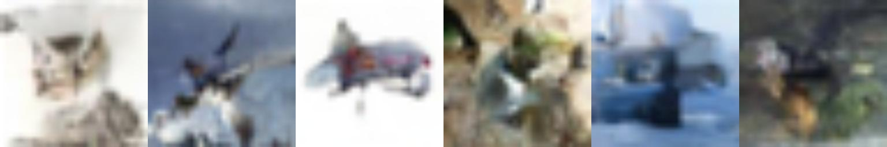
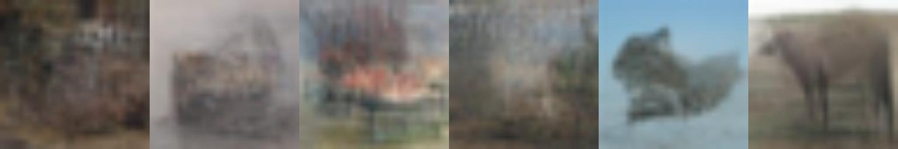
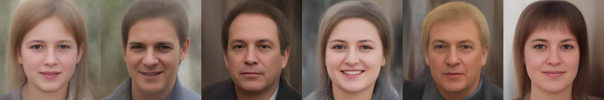
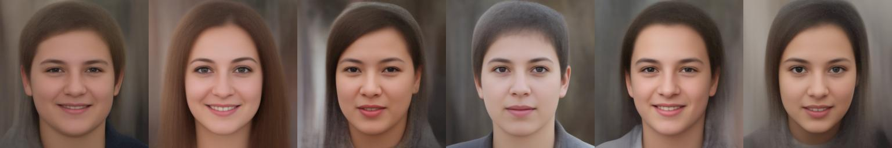

# About
This project is a refactored version of the Very Deep Variational Auto Encoder (VDVAE) developed by Rewon Child.  The original code can be found [here](https://github.com/openai/vdvae) and the paper can be found [here](https://arxiv.org/abs/2011.10650).  The paper gives a good high-level overview of the model and directs readers to the GitHub repo for implementation details.  I performed a full rewrite with heavy commenting to fully absorb the conceptual and implementation details.

# Getting Started

Note:  the default device is `cpu`, but any valid pytorch device string may be
specified with the `--device` option (ie. `--device cuda:0`).  See [this](https://pytorch.org/docs/stable/tensor_attributes.html#torch.device) for more information on devices.

## Clone the repository
`git clone https://github.com/jlewis200/VDVAE.git`

## Install the requirements
`python3 -m pip install -r requirements.txt`

## Download the pretrained weights
`python3 get_checkpoints.py`

## Sample from a model
`python3 vdvae.py --config ffhq256 --checkpoint checkpoints/ffhq256_pretrained.pt --random 8 --temp 1`

## Train a model

### Download desired datasets
 - CIFAR 10 - The torchvision version of this datset should download automatically
 - FFHQ 256 - After downloading, place `ffhq-256.npy` in the `ffhq256` directory like so:  `VDVAE/ffhq256/ffhq-256.npy`.  Refer to the VDVAE documentation [here](https://github.com/openai/vdvae#setup) to download the dataset.

### Train from scratch
`python3 vdvae.py --config cifar10 --train --batch-size 6`

### Train from a checkpoint
`python3 vdvae.py --config cifar10 --checkpoint checkpoints/cifar10_pretrained.pt --train --batch-size 20`

# Full options list
```
./vdvae.py --help
usage: vdvae.py [-h] [-t] [-l LEARNING_RATE] [-e EPOCHS] [-n BATCH_SIZE] [-m] [-d DEVICE] [--checkpoint CHECKPOINT] [--config CONFIG] [--reconstruct RECONSTRUCT] [--sample SAMPLE] [--temperature TEMPERATURE]

Perform VAE experiments

options:
  -h, --help            show this help message and exit
  -t, --train           train the model
  -l LEARNING_RATE, --learning-rate LEARNING_RATE
                        learning rate
  -e EPOCHS, --epochs EPOCHS
                        number of training epochs
  -n BATCH_SIZE, --batch-size BATCH_SIZE
                        batch size
  -m, --mixture-net-only
                        only train mixture net
  -d DEVICE, --device DEVICE
                        torch device string
  --checkpoint CHECKPOINT
  --config CONFIG
  --reconstruct RECONSTRUCT
                        encode/decode an image
  --sample SAMPLE       number of samples
  --temperature TEMPERATURE
                        temperature of samples
```

# Unit tests
Unit tests can be run from the project root by using the command
`python3 -m unittest`

# Sampled images
Note:  Temperature controls the fraction of the trained standard deviation to use when sampling.

## CIFAR 10 (upsampled to 256 x 256)
Temperature 1.0


Temperature 0.8


Temperature 0.6


## FFHQ 256
Temperature 1.0


Temperature 0.8


Temperature 0.6


Temperature 0.4


Temperature 0.3

